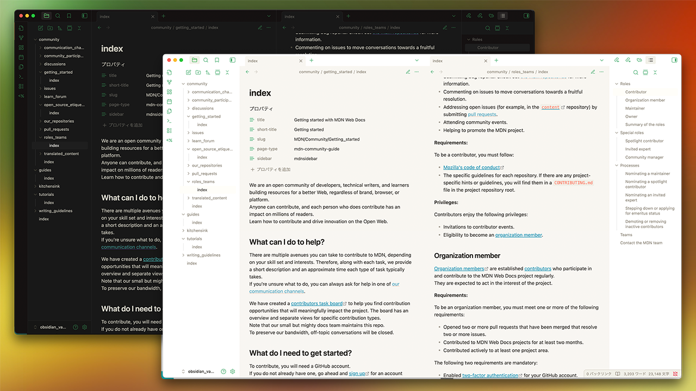
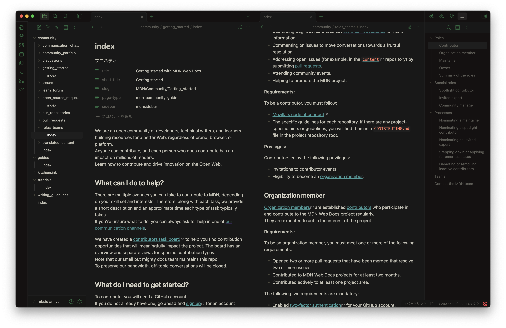
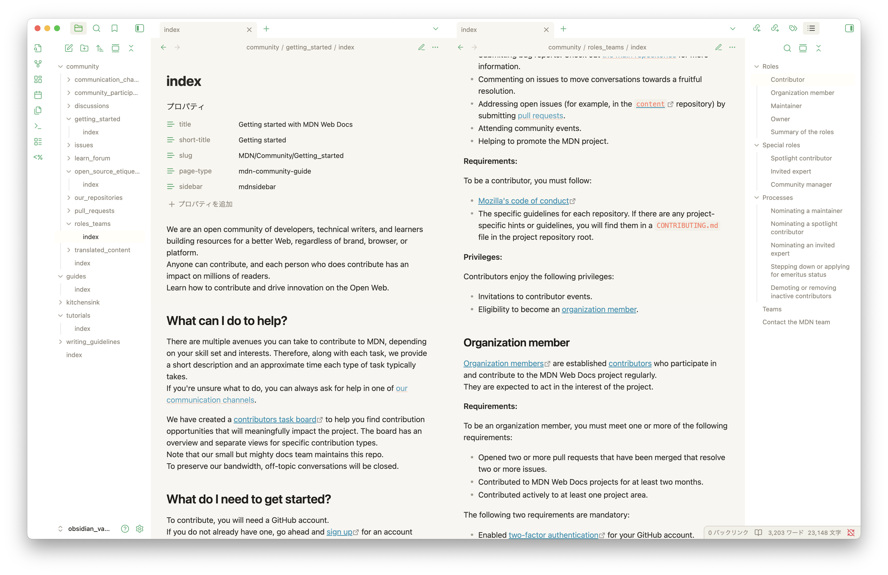

# Hydra Pressure for Obsidian

**Hydra Pressure** wraps Obsidian in candy-neon ember orange and chilled cyan, pairing industrial edges with playful highlights; the name nods to the [_Hydra Splatling_](https://splatoonwiki.org/wiki/Hydra_Splatling) kit that inspired the palette’s high-pressure contrast.

## Installation

1. Download the latest `theme.css` and `manifest.json`.
2. Place them inside `.obsidian/themes/Hydra Pressure`.
3. In Obsidian, open *Settings → Appearance → Themes* and select **Hydra Pressure**.

## License

Released under the MIT license.

